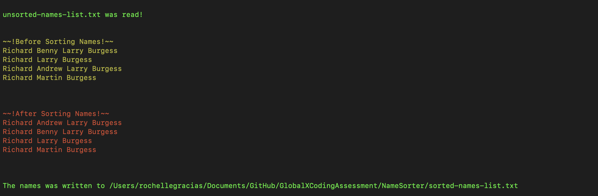

## The Goal: Name Sorter 
Build a name sorter. Given a set of names, order that set first by last name, then by any given names the person my have. A name must have at least 1 given name and may have up to 3 given names.

## ScreenShot of output


## Motivation
The GlobalX coding assessment for the role of a Junior Engineer.

## Build status [](https://travis-ci.com/graciasrochelle/GlobalXCodingAssessment)
Build status of continus integration i.e. travis. Travis CI is configured by adding a file named .travis.yml.

## Code style
Implemented using Dependency Injection to achieve safe, reliable and secure source code. The idea of the pattern itself is to create decoupled systems that the implementation of lower level domain is not a concern of the implementor, and can be replaced without having concern of breaking implementor function.

## Tech/framework used
### Built with
- [Visual Studio for MAC](https://tutorials.visualstudio.com/vs4mac-install/install)

### Logger
- [NLog](https://github.com/NLog/NLog.Extensions.Logging/wiki/Getting-started-with-.NET-Core-2---Console-application)

**nlog.config** _Add nlog.config in the same location as NameSorter.dll_
```
<?xml version="1.0" encoding="utf-8" ?>
<nlog xmlns="http://www.nlog-project.org/schemas/NLog.xsd"
      xmlns:xsi="http://www.w3.org/2001/XMLSchema-instance">

    <targets>
        <default-target-parameters xsi:type="File" keepFileOpen="false"/>
        <target name="logdebug" xsi:type="File"
                layout="DateTime::${longdate}||LogLevel::${level}||Logger::${logger}||${message} ${exception:format=ToString}" 
                fileName="../../../Logs/DebugLog_${shortdate}.txt"/>
        <target name="logfatal" xsi:type="File" fileName="../../../Logs/FatalLog_${shortdate}.txt" layout="DateTime::${longdate}||${message} ${exception:format=tostring}"/>
        <target name="loginfo" xsi:type="File" fileName="../../../Logs/InfoLog_${shortdate}.txt" layout="DateTime::${longdate}||${message}"/>
    </targets>

    <rules>
        <logger name="*" minlevel="Debug" writeTo="logdebug" />
        <logger name="*" minlevel="Fatal" writeTo="logfatal" />
        <logger name="*" minlevel="Info" writeTo="loginfo" />
    </rules>
</nlog>
```
### Testing Framework
- [xUnit.net](https://xunit.github.io/docs/getting-started-dotnet-core)

## Features
- Takes two command line arguments - Argument 1 is the feature name and Argument 2 is the filename that contains the Names to be sorted:
```
cd GlobalXCodingAssessment/NameSorter
dotnet run name-sorter ./unsorted-names-list.txt
```

Or set Visual Studion environment variables
> Project -> Options -> Run -> Configuration -> Default -> Arguments -> `name-sorter ./unsorted-names-list.txt` -> OK

- The program reads the file and sorts the set of names by last name. A name must have at least 1 given name and may have up to 3 given names
- The program then writes the sorted set of names to a file `sorted-names-list.txt`
- The program also prints the unsorted and sorted set of names on the screen once the program executes

## Installation
- Step 1: Install Visual Studio or VSCode
- Step 2: Clone the project
- Step 3: Open Cloned project
- Step 4: Clean and Build project
- Step 5: Run project

**Nuget Dependencies**
- .Net version : `2.1.302`
- Microsoft.Extensions.DependencyInjection : `2.1.1`
- NLog : `4.5.11`
- NLog.Extensions.Logging : `1.3.0`
- xUnit : `2.3.1`
- xUnit.runner.visualstudio : `2.3.1`
- Microsoft.NET.Test.Edk : `15.7.0`

## Tests
**Run tests via terminal**
```
cd GlobalXCodingAssessment
dotnet test NameSorterTester/NameSorterTester.csproj
```
**Run tests via IDE**
- Step 1: Open cloned project
- Step 2: Select `NameSorterTester-UnitTests`
- Step 3: Run project

## How to use?
_Please ensure valid filename is passed and file is placed within the NameSorter Folder_

**Run project via terminal**
```
git clone git@github.com:graciasrochelle/GlobalXCodingAssessment.git
cd GlobalXCodingAssessment/NameSorter
dotnet build
dotnet run name-sorter ./unsorted-names-list.txt
```
**Run test via terminal**
```
cd GlobalXCodingAssessment
dotnet build
dotnet test NameSorterTester/NameSorterTester.csproj
```
